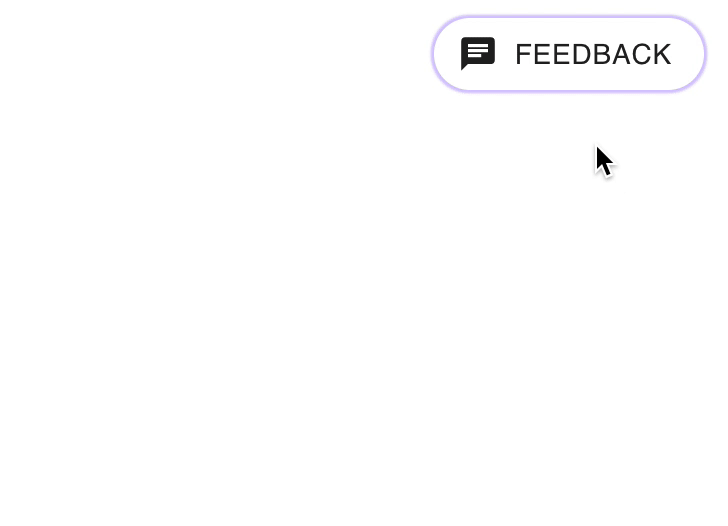

# minmal-feedback

[](https://www.npmjs.com/package/minimal-feedback) [](https://standardjs.com) [ ](https://www.npmjs.com/package/minimal-feedback)

**minimal-feedback** is a blazingly fast and highly customizable component to get user feedback.

<p align="center">
  
</p>

### Live Demo

---

[Live Demo at minimal-feedback](https://dulajkavinda.github.io/minimal-feedback/)

### Why

---

I needed a "feedback component" for my projects. Since I was unable to find one which met my requirements which is very minimal looking and user friendly ui this is what i came up with.

### Installation

---

The preferred way of using the component is via NPM

```bash
npm install --save minimal-feedback
```

### Usage

---

Here's a sample implementation that creates a custom popup on a dummy Create-React-App page.

```jsx
import React, { useState } from 'react'

import MinimalFeedback from 'minimal-feedback'
import 'minimal-feedback/dist/index.css' // don't forget to import css

const App = () => {
  const [text, settext] = useState({ feedback: '' })

  const saveFeedback = () => {
    // logic here
    console.log(text)
  }

  return (
    <MinimalFeedback
      save={saveFeedback}
      value={text}
      onChange={(e) => settext(e)}
    />
  )
}

export default App
```

### Options

---

| Option                  | Type       | Default                   | Description                                                |
| ----------------------- | ---------- | ------------------------- | ---------------------------------------------------------- |
| [`value`](#value)       | `Object`   | `{ feedback:'', type:''}` | Set this to the value you get from the `onChange` function |
| [`onChange`](#onChange) | `Function` | `()`                      | Called when user is typing something                       |
| [`save`](#save)         | `Function` | `()`                      | Called when `submit button` is clicked                     |

### Sample Usage

```jsx
<MinimalFeedback
  save={saveFeedback}
  value={text}
  onChange={(e) => settext(e)}
/>
```

### Dev

---

The component is written in ES6 and uses [Webpack](http://webpack.github.io/) as its build tool.

#### Set up instructions

---

```
git clone https://github.com/dulajkavinda/minimal-feedback.git
cd minimal-feedback
npm install
npm start
```

### Contributing

---

Got ideas on how to make this better? Open an issue [here!](https://github.com/dulajkavinda/minimal-feedback/issues)
Issues, Pull Requests and all Comments are welcome!

## License

MIT © [dulajkavinda](https://github.com/dulajkavinda/minimal-feedback/blob/master/LICENSE)
